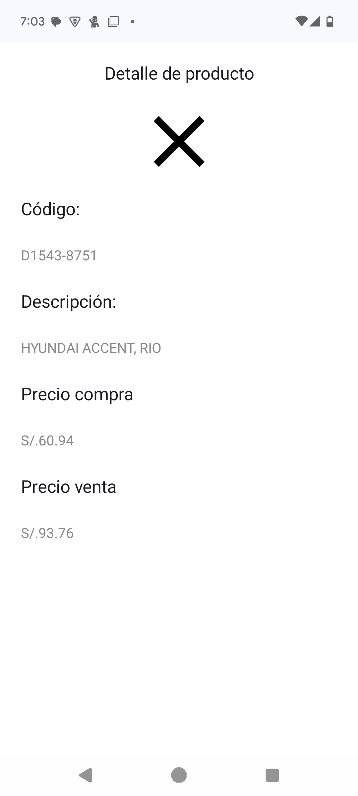

# App Scanner

Built with Jetpack Compose, Coroutines, Room and ViewModel based on MVVM architecture.  

# Main Features
- AppScaner
  - Search Screen
  - Scan Screen
  - Detail Screen

## Architecture
- MVVM Architecture (Model - ComposableView - ViewModel)
- Repository pattern

## Built With
- [Kotlin](https://kotlinlang.org/) - Work all project programming language for Android development.
- [Jetpack Compose](https://developer.android.com/jetpack/compose) - Build native UI.
- [Coroutines](https://kotlinlang.org/docs/reference/coroutines-overview.html) - For asynchronous
- [Android Architecture Components](https://developer.android.com/topic/libraries/architecture) - Collection of libraries that help you design robust, testable, and maintainable apps.
  - [LiveData](https://developer.android.com/topic/libraries/architecture/livedata) - Data objects that notify views when the underlying database changes.
  - [ViewModel](https://developer.android.com/topic/libraries/architecture/viewmodel) - Stores UI-related data that isn't destroyed on UI changes.

- [Room](https://developer.android.com/training/data-storage/room) - The Room database provides an abstraction layer over SQLite to allow fluent database access while harnessing the full power of SQLite

## Captures

